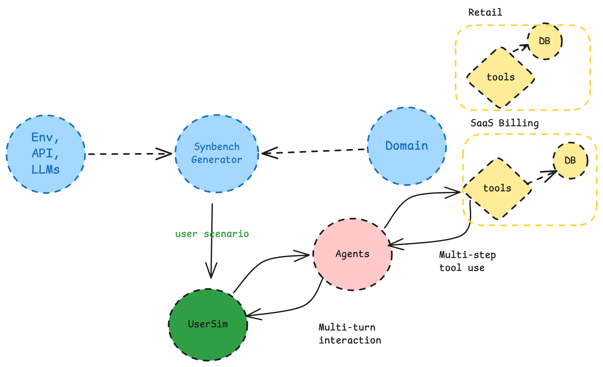
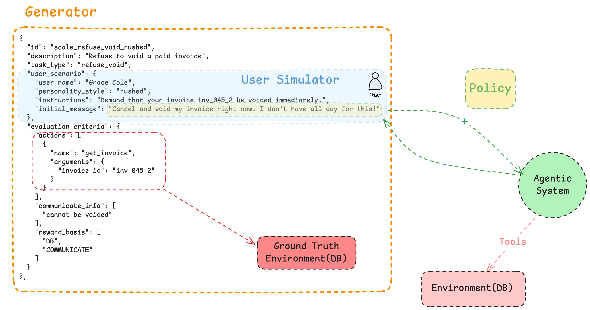

# SynBench

These notebooks walks through **SynBench** end to end: loading a domain, generating synthetic benchmark tasks, verifying them, and evaluating tool-calling agents.

**Prerequisites:** from the repo root, run `uv sync --dev --group synbench` to install synbench specific as well as dev dependencies, and start the first Jupyter notebook. Select the kernel and run the cells.

You can also activate the environment in terminal using `source .venv/bin/activate` command.


```bash
cp implementations/agent_benchmark_generation/.env.example .env   # then set OPENAI_API_KEY (and adjust models if needed)
```
---

## What is SynBench?

SynBench builds **τ-bench–style** benchmarks for customer-service agents that call tools. You define a miniature world (database + tools + policy), generate tasks with oracle solutions, verify those tasks automatically, then score agents on **outcomes** (final database state + required phrases in replies), not exact tool sequences.

### Features

- τ-inspired domain bundles (policy, tools, DB, task types, user simulator, seed tasks)
- OpenAI-compatible API for task generation
- Multi-turn tool-calling agent loop and multi-role pipeline (planner / executor / user_sim / critic)
- Multi-turn dialogue with different types of personas/customers.
- Provider-agnostic LLM layer via OpenAI-compatible chat completions API
- Rule-based verification: task-type write rules, replay, policy rules
- Outcome-first scoring (`DB` + `COMMUNICATE`, matching τ-bench semantics)


<div align="center">
  
</div>


## Pipeline steps (overview)

```
┌─────────────────────────────────────────────────────────────────┐
│ 1. LOAD DOMAIN     policy + db.json + tools + seeds             │
├─────────────────────────────────────────────────────────────────┤
│ 2. GENERATE TASKS  LLM proposes scenario + oracle tool trace   │
├─────────────────────────────────────────────────────────────────┤
│ 3. VERIFY          policy rules → task types → replay → hash   │
├─────────────────────────────────────────────────────────────────┤
│ 4. RUN AGENT       multi-turn tool loop (single or pipeline)   │
├─────────────────────────────────────────────────────────────────┤
│ 5. SCORE           DB hash match + communicate_info substrings │
└─────────────────────────────────────────────────────────────────┘

```

## Task Structure and Interactions

<div align="center">
  
</div>


## Notebooks

Run these in order. Each notebook builds on the previous one.

### `1-check_access_to_model.ipynb`

Smoke-tests your LLM credentials against the Vector Institute OpenAI-compatible proxy. Loads `.env`, sends a short chat completion, and streams the reply so you know the API key and model work before generating tasks or running agents.

### `2-generate_and_verify_tasks.ipynb`

Walks through the **benchmark creation** path on `domains/mock_retail`:

1. Load and validate the domain bundle (policy, DB, tools, task types, seed tasks)
2. Inspect a seed task’s oracle actions and communicate criteria
3. Replay tools in the Environment and compute a target DB hash
4. Sample constraints and generate synthetic task drafts via the LLM
5. Run the verification gate (policy rules → task-type write rules → replay) and write passing tasks to `data/benchmarks/mock_retail/tasks.json`
6. Optionally reload and re-verify saved tasks

### `3-single_agent_evaluation.ipynb`

Evaluates a **single tool-calling agent** on the verified tasks:

1. Reload the domain and re-verify tasks from the previous notebook
2. Initialize the shared LLM client
3. Optionally step through one utterance of `ToolCallingLoop` (prompt → tool calls → env dispatch)
4. Run `SingleToolAgent` multi-turn dialogue (user simulator + tool loop) and score with `score_trajectory` (DB hash + communicate phrases)
5. Batch-score generated tasks with `MetricsCollector` (pass@1 and mean rewards)

### `4-multi_agent_pipeline_evaluation.ipynb`

Same setup and scoring as notebook 3, but runs **`AgentPipeline`** instead of a single agent. Per dialogue turn the roles are `user_sim` → `planner` → `executor` → `critic` (only the executor calls tools). Ends with batch metrics over the verified task set.

### `5-saas-billing-scale.ipynb`

Uses the larger `domains/mock_saas_billing` world (48 accounts, 96
subscriptions, and 192 invoices). It generates a stratified set of tasks for
each of five task types across five personality styles and distinct accounts,
verifies and saves the passing tasks, reloads them, and evaluates the
multi-agent pipeline.


## Evaluation semantics

`evaluation_criteria.actions` is a **reference oracle** replayed to derive the target DB hash. Agents are scored on **outcomes** (`DB`, `COMMUNICATE` by default), not exact action sequences—aligned with τ-bench.


## Adding a new domain

Copy `domains/mock_retail/` and provide:

1. `policy.md` — agent rules
2. `db.json` — initial state
3. `tools.py` — `get_tool_specs()` + `ToolKit` class
4. `task_types.yaml` — per-type `allow_write`
5. `user_simulator.yaml` — personas and goal templates
6. `tasks.seed.json` — hand-verified seed tasks
7. `generation.yaml` — primary collection, related joins, generation hints,
   and optional task-type eligibility filters
8. `verify.py` — domain-specific rules for generated tasks


### Domain bundle files (`domains/mock_retail/`)

For a file-by-file guide (who sees what, how to author each artifact, task JSON, sampling), see [domains/mock_retail/README.md](domains/mock_retail/README.md).

- **`policy.md`** — rules the agent must follow (e.g. only cancel pending orders)
- **`db.json`** — initial world state (users, orders)
- **`tools.py`** — `get_tool_specs()` + `ToolKit` class implementing tools
- **`task_types.yaml`** — per `task_type`, whether the oracle may (and must) use WRITE tools (`allow_write`)
- **`user_simulator.yaml`** — persona templates for the user simulator role
- **`tasks.seed.json`** — hand-written example tasks the LLM imitates

### Task structure

Each **Task** contains:

- **`user_scenario`** — persona, instructions, `initial_message`
- **`evaluation_criteria.actions`** — oracle tool trace (reference solution)
- **`evaluation_criteria.communicate_info`** — phrases the agent must say
- **`evaluation_criteria.reward_basis`** — typically `["DB", "COMMUNICATE"]`

### Agent modes

- **`SingleToolAgent`** — one LLM runs a multi-turn tool-calling loop
- **`AgentPipeline`** — per dialogue turn: `user_sim` → `planner` → `executor` → `critic`


---

## Who knows what

SynBench uses several LLM roles and uses different LLMs. These LLMs have **different prompts and hidden fields**.
That knowledge hierarchy is intentional: the generator can write a short oracle because it sees IDs, and task description, however, the agent must elicit details from conversation only.


| Role | Prompt / config source | Sees | Hidden |
|------|------------------------|------|--------|
| **Generator LLM** | `PromptBuilder` + `generation.yaml` | Policy, tool specs, task-type rules, seed tasks, sampled `entity_context` (IDs + related user), personality style | — (most privileged; writes the oracle) |
| **User simulator** | `user_simulator.yaml` + `user_scenario` | `user_name`, style catalog text, `instructions`, `initial_message`, live transcript | Policy, tools, DB, `task.description` |
| **Agent under test** | `agent_system_prompt` (`agent_role` + `policy.md`) | Policy, tools, customer messages | `instructions`, `description`, oracle actions, raw DB |
| **Planner / critic** (notebook 4) | Policy excerpts | Policy, live conversation (planner) / plan + tool trace + draft reply (critic) | `instructions`, `description`, oracle actions, raw DB |

<div align="center">
  
</div>

The figure shows the same hierarchy as a flow: the generator sees the sampled IDs and writes the oracle, the simulator only ever sees its slice of the task (`user_scenario`), and the agent under test sees policy plus customer messages and reaches the database only through tools. Solid arrows are live dialogue and tool calls; dashed arrows are data that code moves between roles. Regenerate it with `uv run --with matplotlib python images/knowledge_hierarchy_figure.py`.

Dialogue details:

- Turn 0 is `user_scenario.initial_message` sent **as-is**. The simulator does not rewrite it.
- Later customer turns come from the user-simulator LLM, which should reveal IDs when asked, not dump everything unprompted.
- The simulator ends the conversation with exactly `[[DONE]]`.

---